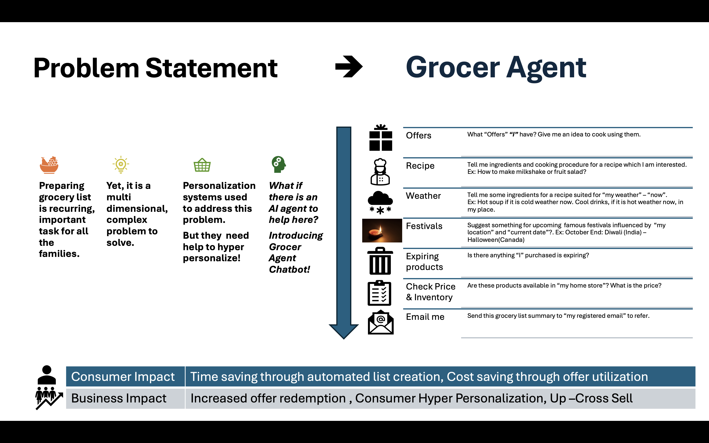
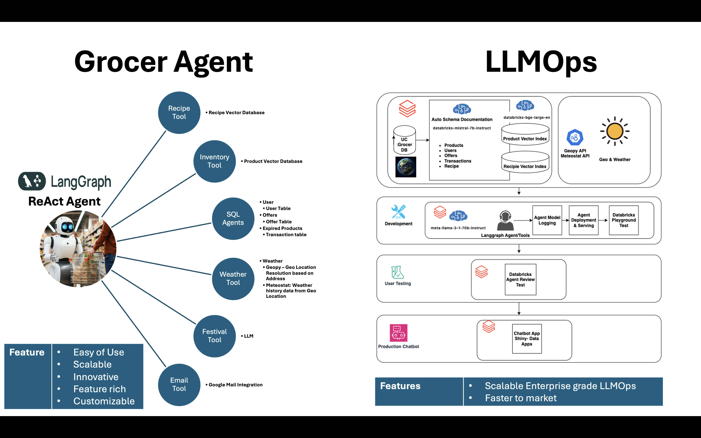

# Grocer - Grocery AI Agent

Welcome to Team Neuron's submission for the Databricks 2024 Gen AI Hackathon.

[Demo Video](https://www.youtube.com/watch?v=jWJrtSschmk&ab_channel=neuron)

## Solution Overview

"Grocer" is a Multi-Agent system with key components:

- **Data Preparation Notebook**
- **ReAct Agent**
- **Retrieval-Augmented Generation (RAG) tools** on multiple vector databases
- **SQL Agents**
- **Front-end Shiny Chatbot**

## Features & Innovations

- **Automatic Documentation**: Generates table and schema documentation using an LLM to support SQL agents.
- **Free-Text Inventory Search**: Enables inventory search based on product descriptions, not just IDs.
- **Weather Integration**: Uses open-source APIs for real-time weather information.

   Special thanks to [geopy](https://github.com/geopy/geopy) (MIT License) and [meteostat](https://github.com/meteostat/meteostat-python) (MIT License). For more information, please visit their pages.

   *Note: Geopy with Nominatim is used here to support OpenStreetMap for demonstration purposes only. See OpenStreetMap’s Nominatim policy [here](https://operations.osmfoundation.org/policies/nominatim/).*

- **Email Integration**: Allows email notifications directly through the tool.
- **Agent Testing**: Includes unit test steps within agent code.
- **User-Friendly Design**: Guided flows and guardrails enhance usability and reduce hallucination risks.
- **And more**: Explore the code and watch our demo for additional features.

## Next Steps

- **Guardrails with LlamaGuard**: Strengthening model safety.
- **LangGraph Modularization**: Introducing nodes and edges for enhanced control and deterministic behavior.

